<h1 align="center">Welcome to boilerplate-lib-vite-react 👋</h1>
<p>
  
  <a href="https://github.com/panhavsilva/boilerplate-lib-vite-react#readme" target="_blank">
    
  </a>
  <a href="https://github.com/panhavsilva/boilerplate-lib-vite-react/graphs/commit-activity" target="_blank">
    
  </a>
  <a href="https://github.com/panhavsilva/boilerplate-lib-vite-react/blob/master/LICENSE" target="_blank">
    
  </a>
</p>

> Boilerplate to create library with Vite, Typescript and React.js

<br />

## :black_nib: Author

:bust_in_silhouette: **Pâmela Vieira da Silva - @panhavsilva**

* Github: [@panhavsilva](https://github.com/panhavsilva)

---

## Install dependencies

```sh
yarn
```
## Run the dev server
```sh
yarn dev

#dev server running at: http://localhost:3000/
```

## 
## Scripts
| Script                        | Description                                                    |
| ----------------------------- | -------------------------------------------------------------  |
| `yarn dev`                    | Run dev server                                                 |
| `yarn build`                  | Generates production build                                     |
| `yarn lint`                   | Run linter                                                     |
| `yarn lint:fix`               | Fix lint errors                                                |
| `yarn type-check`             | TS type checking                                               |
| `yarn ci`                     | Run lint, type checking and tests (meant to be used in a CI)   |
| `yarn prepare`                | Not supposed to be manually used. It's just to configure husky |

## :rocket: Usage
  ### [Creating your token for  publish in to NPM](https://docs.npmjs.com/creating-and-viewing-access-tokens)
  1. In the upper right corner of the page, click your profile picture, then click "Access Tokens". <br />
  <div style="text-align:center">
    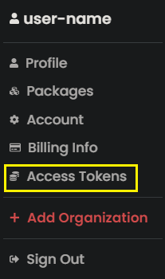
  </div>
  2. Click "Generate New Token". <br />
  <div style="text-align:center">
    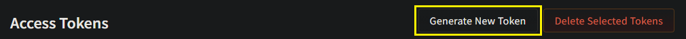
  </div>
  3. Name your token "NPM_TOKEN". <br />
  4. Select the type of access token "Automation". <br />
  5. Click "Generate Token". <br />
  <div style="text-align:center">
    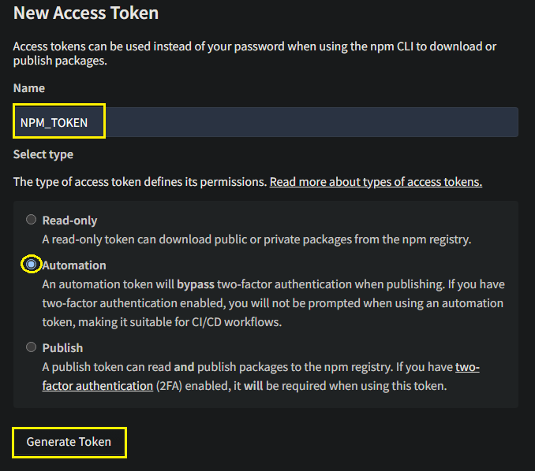
  </div>
  6. Copy the token from the top of page to include in Github secrets.

  <br />

  ### Configuring your secrets on Github
  1. On GitHub, navigate to the main page of the repository.
  2. Under your repository name, click on the "Settings" tab.
  3. In the left sidebar, click "Secrets" after click "Actions".
  4. Click on button "New repositury secret" on the right.
  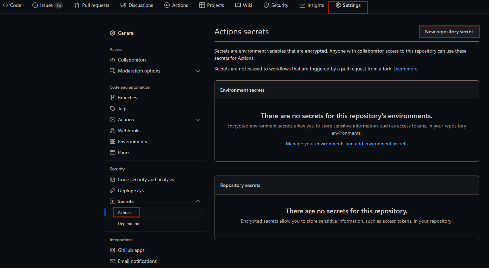
  5. Type NPM_TOKEN in the "Name" input box.
  6. Type the value for your secret.
  7. Click "Add secret".
  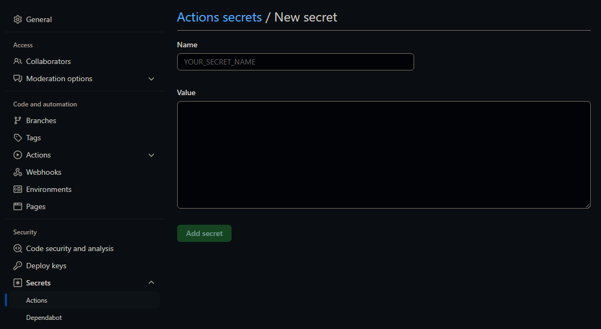

  ### Generate tag version on Github
  1. On GitHub, navigate to the main page of the repository.
  2. Under your repository name, click on the "Actions" tab.
  3. In the left sidebar, click "Generate tag version".
  4. Click on button "Run workflow".
  5. Select branch to use generate tag version workflow and select version (patch, minor or major).
  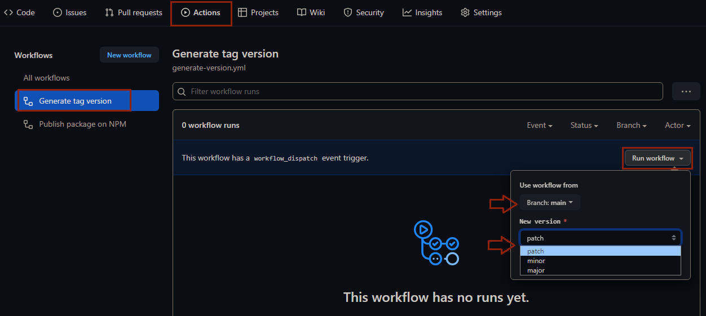
  6. Click on button "Run workflow".
  <div style="text-align:center">
    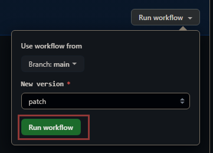
  </div>

  ### [Create Releases](https://docs.github.com/en/repositories/releasing-projects-on-github/managing-releases-in-a-repository)
  1. On GitHub, navigate to the main page of the repository.
  2. To the right of the list of files, click "Releases".
  <div style="text-align:center">
    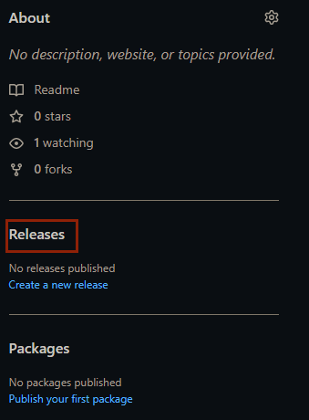
  </div>
  3. Click on button "Create a new release" if your first realese or on button "Draft a new release".
  <div style="text-align:center">
    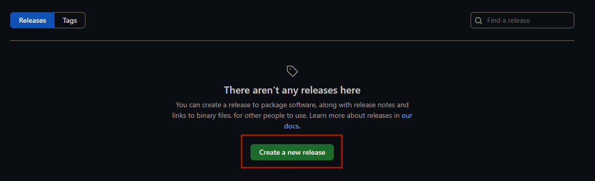
    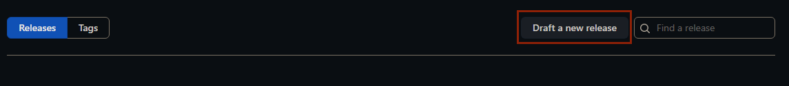
  </div>
  4. Click "Choose a tag", select a version number for your release. <br />
  5. Click "Auto-generate release notes". <br />
  6. Click on button "Publish release". <br />
  <div style="text-align:center">
    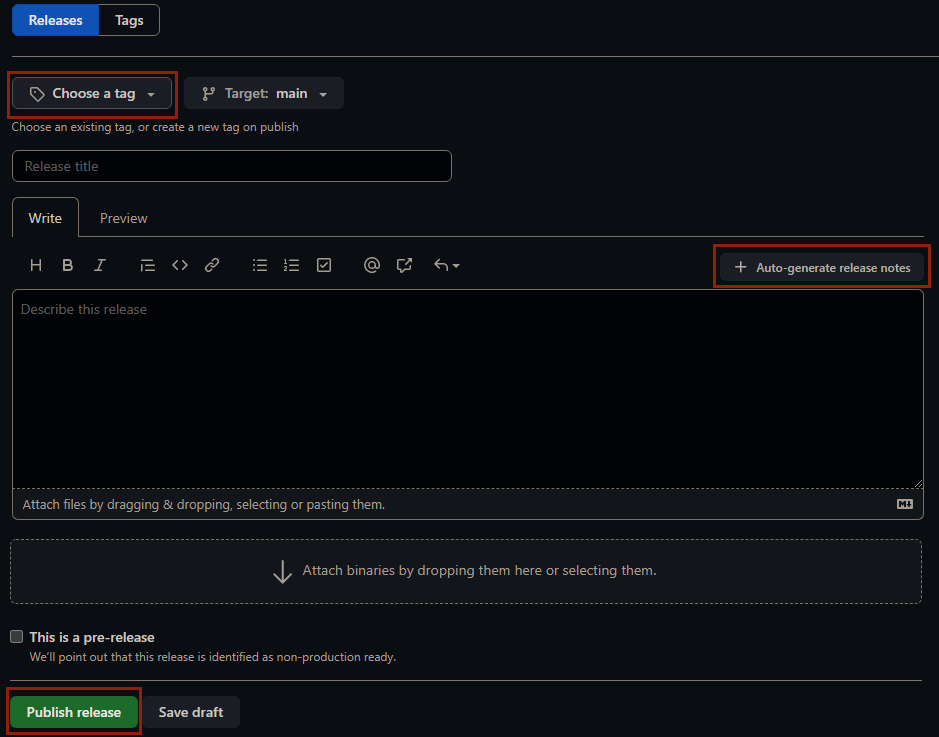
  </div>

  ### Change in your project
  - In to folder lib: 
    + Change main.tsx to name of your lib.tsx
    + Include code of your lib here.
  - In to package.json:
    ```json
      {
        "name": "", //@+"your username NPM"/"name of your lib" without quotes and plus signal
        "description": "", //description of your lib
        "main": "./dist/name of your lib.umd.js", //put the name of your lib.umd.js
        "module": "./dist/name of your lib.es.js", //put the name of your lib.es.js
        "types": "./dist/lib/main.d.ts", // put the name of your lib.d.ts
        "exports": {
          ".": {
            "import": "./dist/name of your lib.es.js", // put the name of your lib.es.js
            "require": "./dist/name of your lib.umd.js" // put the name of your lib.umd.js
          }
        },
        "repository": {
          "type": "git",
          "url": "" //url of repository of your lib on Github
        },
        "keywords": [], //include keywords searched in NPM relative to your lib
        "author": "", //your name
        "bugs": {
          "url": "https://github.com/your username/your repository/issues" //url of repository of your lib on Github/issues
        },
        "homepage": "https://github.com/your username/your repository#readme" //url of repository of your lib on Github#readme
      }
    ```
  - In to tsconfig.node.json:
    ```json
      {
        "paths": {
          "@username NPM/name of your lib": [ "./lib/name of your lib.tsx" ]
        } //put @ + your username NPM/name of your lib: put the name of your lib
      }
    ```
  - In to vite.config.ts:
    ```typescript
      build: {
        lib: {
          entry: resolve('lib', 'main.tsx'),
          name: 'ReactFeatureFlag',
          fileName: (format) => `name of your lib.${format}.js`, //put the name of your lib
        },
        rollupOptions: {
          external: ['react'],
        },
      },
    ```
  - In to src/ app.tsx 
    + Import your lib from ./lib.
    + Include your lib in the return function app.
  - Assets folder can be deleted
  - Change README.md


---
## :handshake: Contributing

Contributions, issues and feature requests are welcome!<br />Feel free to check [issues page](https://github.com/panhavsilva/boilerplate-lib-vite-react/issues). You can also take a look at the [contributing guide](https://github.com/panhavsilva/boilerplate-lib-vite-react/blob/master/CONTRIBUTING.md).

---
## ✨ Show your support

Give a ⭐️ if this project helped you!

## 📝 License

Copyright © current [Pâmela Vieira da Silva - @panhavsilva](https://github.com/panhavsilva).<br />
This project is [MIT](https://github.com/panhavsilva/boilerplate-lib-vite-react/blob/master/LICENSE) licensed.
